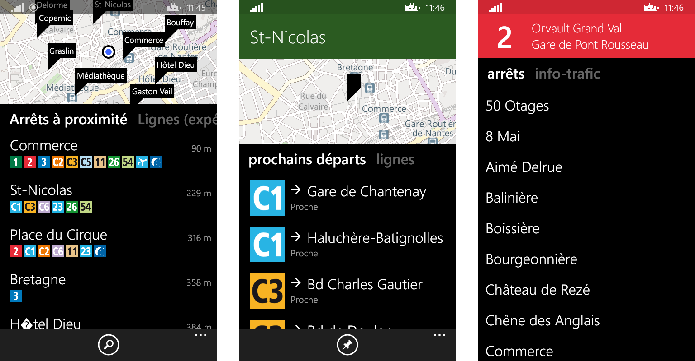

# Nantes Tram & Bus :tram: :fr:

*Nantes Trams & Bus* est une application Windows Phone 8 qui permet de se déplacer plus facilement sur le réseau [TAN](http://www.	tan.fr). 
L'application offre la possibilité de :
  - Visualiser les arrêts à proximité,
  - Connaître les prochains départs en temps réel à un arrêt,
  - Avoir un aperçus des arrêts desservis par une ligne.
  
> :warning: Le développement de NTB est arrêté, la nouvelle URL de l'API publique de la Semitan a quand même été ajoutée avant publication.
